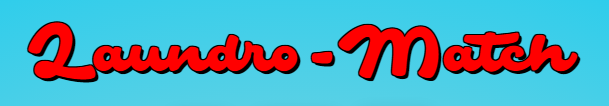
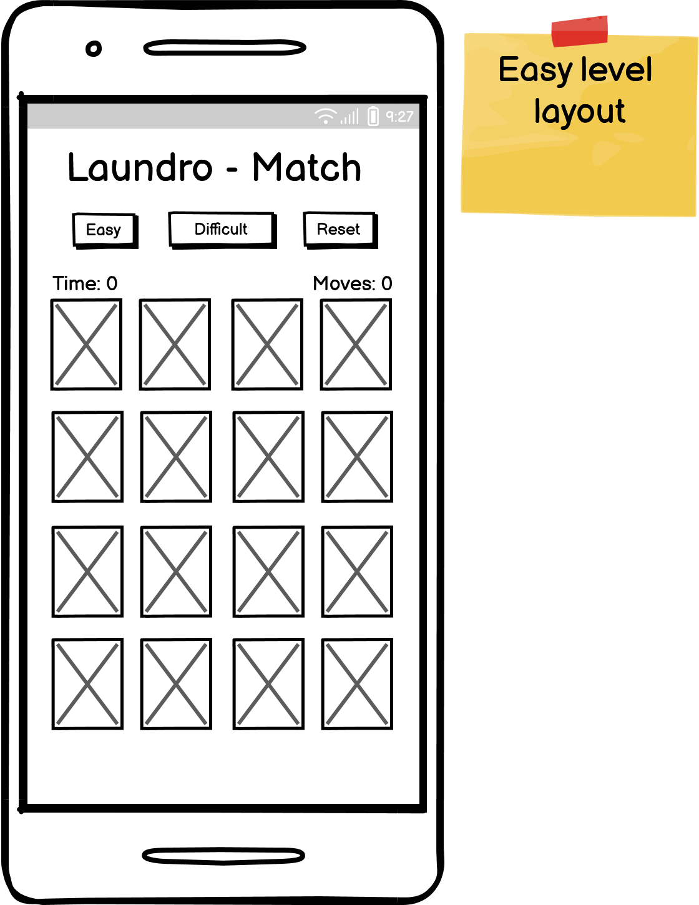
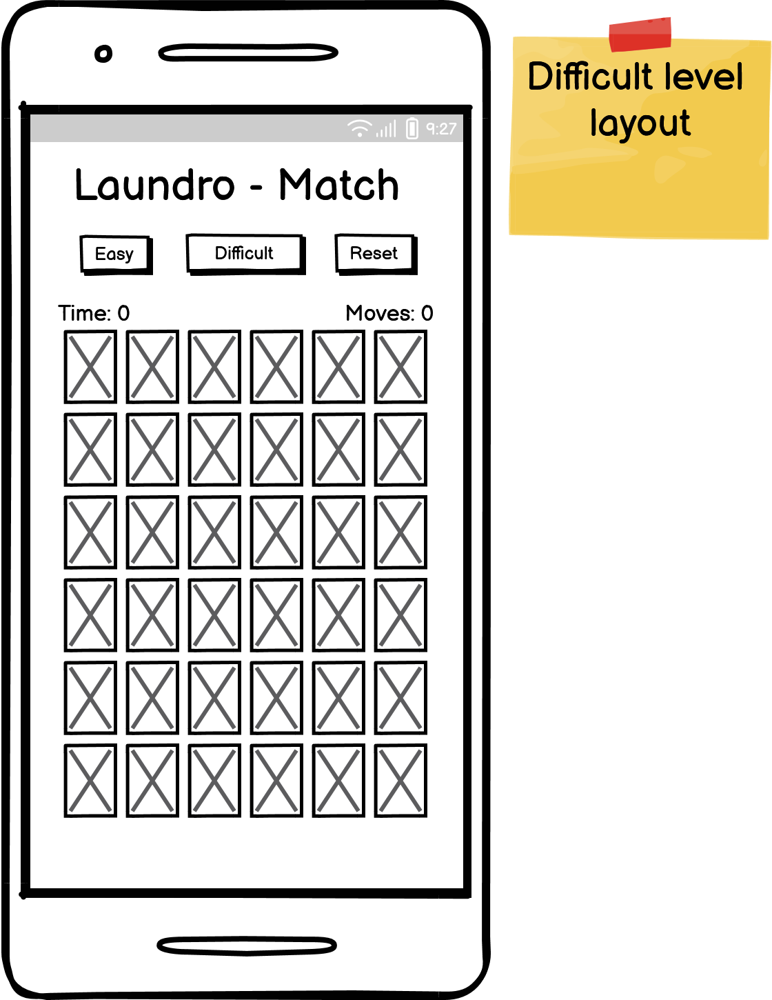
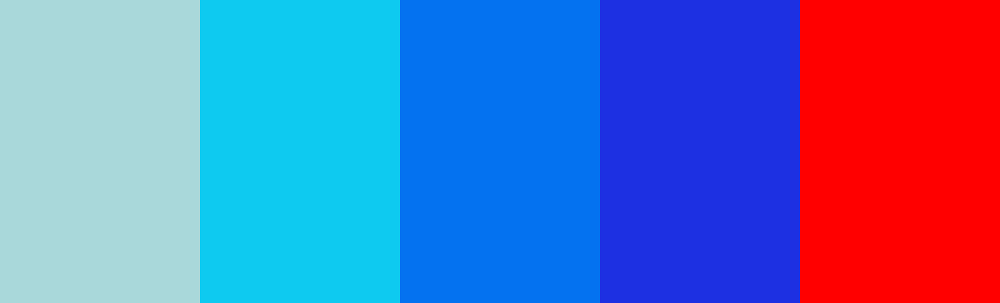
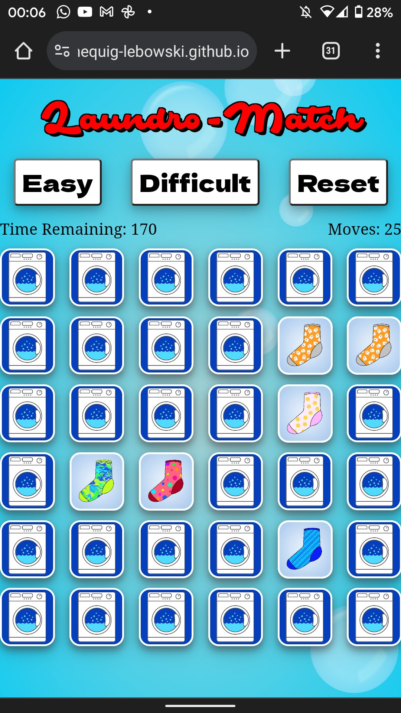
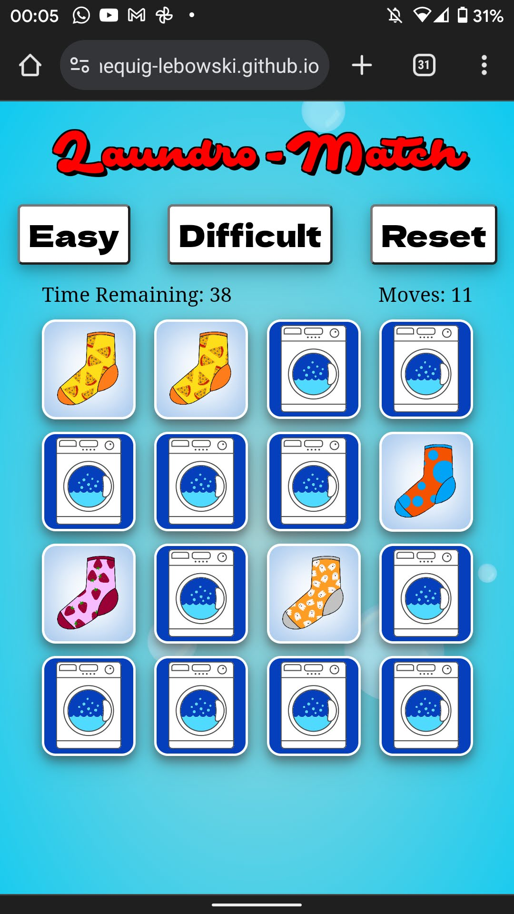
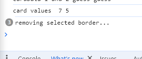
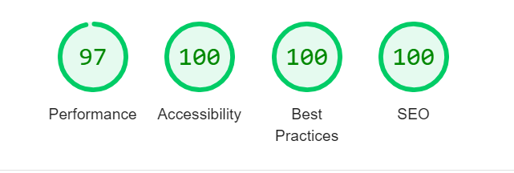

# Laundro-Match



 Welcome to Laundro-Match, a classic card-based memory game themed around the usually mundane task of pairing socks. A silly little bit of fun, really.  

Visit the deployed site [here.](https://thequig-lebowski.github.io/ci-portfolio-two/index.html)

---

## Contents

1. [UX](#UX)
	* [Strategy](#Strategy) 
	* [Scope](#Scope)
	* [Structure](#Structure)
	* [Skeleton](#Skeleton)
	* [Surface](#Surface)
      * [User Stories](#User-Stories)
      * [Design](#Design)
2. [Features](#Features)
  * [Game Logic](#game-logic)
	* [Existing Features](#Existing-Features)
	* [Future Features](#Future-Features)
3. [Technologies Used](#Technologies-Used)
4. [Testing](#Testing)
	* [Device Testing](#Device-Testing)
	* [Validation](#Validation)
5. [Deployment](#Deployment)
6. [Credits](#Credits)
	* [Code](#Code)
	* [Images](#Images)

# UX

## Strategy
The main goal of this project are to ensure enjoyment. This simple game is designed to engage users and offer a touch of entertainment. When played on a larger device like an iPad, the game could assist in developing hand-eye coordination in young children while also enhancing memory skills for users of all ages.

## Scope
The game should feature bright, inviting graphics and be highly intuitive. Since card-flipping memory games are well-established, users are likely familiar with similar games or their analog versions. Straying from the expected game play could lead to frustration, which is exactly what we want to avoid.

To cater to a diverse audience, the game will offer multiple difficulty levels: easy and hard expanding in the future possibly with an "insane" mode. The game play will remain consistent across all levels, with the only difference being the size of the grid and the number of cards.

## Structure
Given the simplicity of the game concept, the visual design should be straightforward as well. With mobile users in mind, I positioned all the buttons above the game board to prevent accidental presses.

All the information is presented to the user as they need it; a welcome modal explains the rules, a game-over modal explains that they ran out of time and a victory modal tells shows the user how well they did. All of these have a call to action to either start or improve on their last effort.

The tone of the website is light-hearted and fun. This is, firstly obvious through the colour choice and is later complimented in the tone of dialogue that is used; poking a little fun at the user when they don't succeed.

## Skeleton
<details>
  <summary>View wire-frame sketch for 'easy' layout</summary>
  
</details>

<details>
  <summary>View wire-frame sketch for 'difficult' layout</summary>
  
</details>

\
User feedback was a big consideration in this project as it helps the flow of the game and keeps things simple and intuitive.

## Surface
### User Stories
* As a user I want to play a fun game to pass the time
* As a user I want to develop my memory skills and reaction times
* As a user I want my young child to develop their hand-eye coordination 
* As a user I will look for feedback as to weather or not I am using the site/playing the game correctly.
* As the user I want to be able to play the game on my mobile device as well as desktop/laptop  
### Design


Having settled on a name that's a pun on 'laundromat' I searched for a font that I felt matched the old-school, cliche aesthetic of American-style launderette for the main title and settled on Safir Script which I found [here](https://www.fontspace.com/safir-script-font-f24141), at Font Space. As that is quite a busy font I chose something slightly more simple but still complitmented it as the font for the remainder of the site. I landed on [this](https://fonts.google.com/specimen/Dela+Gothic+One), Dela Gothic font from Google Fonts.

## Features
### Game Logic
Not without it's fair share of challenges this project uses some clever solutions to achieve a very robust and stable website.

1. Generating the grid is done with `buildGrid()` function. It takes two parameters; the number of row to build and the amount of time to set on the count down.
It then needs to generate two copies of each card it achieves this by running two nested `for` loops. The inner most loop runs twice while the outer loop runs until the correct number of pairs are created.   
Using template literals the loops adds raw html to an array that then gets written to the DOM once the loop is finished.
2. Next the cards are passed to `shuffleCards()`, which shuffles using the Durstenfeld variation of the Fisher-Yates shuffle method. We take the shuffled array and use it as the `order` attribute for each `card-container`.
3. On the first click of a card `countdownTimer()` starts and the game checks to see if this card is already flipped, if so it continues to flip this card but assign it's value to `secondFlip`. If it's the first card to be flipped it's value is assigned to `firstFlip`.
4. Next the `data-cardnumber` values are compared to each other using `checkedMatchedPairs()` function. If they are not a pair they are "unflipped" and the game continues. If they are a match, an animation is add to provide feedback to the user.
5. After that we call the `checkGameWin()` function to see how many matched pairs we have against how many are available in this game level. Here we check for `totalPairs - 2` as we can assume the last pair are a correct match. If the game has more than two pairs un-matched we continue the game play.
6. If the `checkGameWin()` sees that there is only one pair left it automatically flips it and adds the celebratory animation and runs `getScoreBoard()`, which calculates the game stats, and then runs `showModal(".winner")` witch displays a congratulations message as well as the users score.
7. If the user hasn't managed to find all the pairs before the timer reaches 0 the game ends with another modal preventing any further clicking along with a message offering the user to try again.

### Existing Features
* Global Variables  
In this project I tried very hard to conform to best practices whenever possible. As a result I spent a lot time avoiding the use of global variables, with the exception of `countdown` which is used for `setInterval()` function and wont work with a small scoped variable. The other two were `firstCard` and `secondCard` which needed to be global in order to avoid bugs and to get the game running properly. Given more time, I'm certain even these could be avoided in the global scope, but not a huge issue for now.  
* Fade In/Out Modals  
Animating the modals to fade in gradually and separately from their backdrops. This is a nice subtle effect that suits the tone of the rest of the site and compliments the smoothness of the rest of the site.
* Shuffle Algorithm  
Critical to a card-based memory game is the ability to shuffle the cards each time the game is reset. To accomplish this I used the widely popular Durstenfeld variation of the Fisher-Yates shuffle algorithm. This works by taking the last item from an array and swapping it with an item from a random position within the array from an idex position below it. It will do this for each index position until it reaches the first one [0].
* Flip Animations  
To add to the experience of game play a flip animation was applied to each card whenever it was turned. This reinforced the idea that it was a card that the user was playing with as well as providing a visual que that an input was received or letting them know a card wasn't in play currently. Also having them "unflip" adds another nice aspect to the game play.
* Responsiveness  
Designed for mobile first, a lot of effort went into making sure that the game looked and worked well at all screen sizes and all game levels. To ensure the larger grid looks well, it gets it's own `small-card` class to resize it specifically. Similarly the `colum-gap` and `row-gap` and altered for the larder grid at smaller screen sizes.
* When viewed in Chrome on Android the site theme extends to the browser.

### Future Features
* I would like to see the addition of a score board, stored locally. This would provide another call to action to try to improve
* I would also like to have the option for another level of game play to provide something extra hard for anyone willing to try.
* The addition of 'share' button would be hugely beneficial and provide another call to action.

## Technologies Used
* HTML - The main structure and layout of the page
* CSS - The styling of the page
* JavaScript - used to dynamically control and generate new content
* JQuery Library - used as a shorthand for navigating the DOM
* Photoshop - All the images of the socks were created from scratch
* Tinypng.com - used to optimize the size and quality of the images
* VS Code - used as the environment to develop the project
* Github - used for version control
* Github Pages - this project is currently hosted on Github Pages
* Google Fonts - used to style the main section of the game
* Lighthouse - used for testing the performance and accessibility of the site
* W3C Markup Validator - used to check the markup of the site and ensure there were no major errors.

## Testing
### Testing User Stories
* As a user I want to play a fun game to pass the time.  
  	-The game is engaging, simple and provides adequate challenge
* As a user I want to develop my memory skills and reaction times.  
  	-Providing two levels of difficulty a user has the scope to challenge themselves to improve using their time and score as a bar to beat.

* As a user I want my young child to develop their hand-eye coordination.  

  -Playing the game on a device such as an iPad or smartphone, a young child could indeed develop such dexterity.

* As a user I will look for feedback as to weather or not I am using the site/playing the game correctly.  

	-Visual cues such as flipping the card to let the user know buttons have been clicked. Screen overlays when I run out of time/loose. Notifications when I win or the game is over.

* As the user I want to be able to play the game on my mobile device as well as desktop/laptop  
	-The site is responsive and adapts well across multiply platforms.

## Device Testing
* An early bug I detected was that the `clearInterval()` would not work regardless of where it was called unless the variable it was assigned to was scoped globally. Before this fix there would be multiple instances of the timer running concurrently amd even below zero into negative numbers.
* Another bug I encountered while testing on mobile device was that if cards were clicked too quickly in succession it would result in false matched pairs. To fix this I changed the names of the function parameters so they were unique to each function I also added a `isSelectable()` function which pauses the ability to flip another card if there are two cards currently flipped on the grid. This solved the problem. Later I added the functionality to override this timeout with an additional click to save the user from waiting for the cards to "auto-unflip". <details>
  <summary>screen shots of false matches</summary>
  
  
</details>  

* There were also a few media query bugs that were squashed with little difficulty

* I used the console a lot for debugging one instance I found it helpful was when I had misplaced a call for a function which resulted in the function getting called unnecessarily three times. <details><summary>Screen shot of console</summary></details>
## Validation

* I also ran all the code through CSS and HTML validators and JavaScript linters.

* I also checked the site on WAVE and Lighthouse  



# Deployment
## GitHub Pages

The project was deployed to GitHub Pages using the following steps...

1. Log in to GitHub and locate the GitHub Repository
2. At the top of the Repository (not top of page), locate the "Settings" Button on the menu.
3. Scroll down the Settings page until you locate the "GitHub Pages" Section.
4. Under "Source", click the dropdown called "None" and select "Master Branch".
5. The page will automatically refresh.
6. Scroll back down through the page to locate the now published site link in the "GitHub Pages" section.

## Forking the GitHub Repository

By forking the GitHub Repository we make a copy of the original repository on our GitHub account to view and/or make changes without affecting the original repository by using the following steps...

1. Log in to GitHub and locate the GitHub Repository
2. At the top of the Repository (not top of page) just above the "Settings" Button on the menu, locate the "Fork" Button.
3. You should now have a copy of the original repository in your GitHub account.

## Making a Local Clone

1. Log in to GitHub and locate the GitHub Repository.
2. Under the repository name, click "Clone or download".
3. To clone the repository using HTTPS, under "Clone with HTTPS", copy the link.
4. Open Git Bash
5. Change the current working directory to the location where you want the cloned directory to be made.
6. Type `git clone`, and then paste the URL you copied in Step 3.

```
$ git clone https://github.com/YOUR-USERNAME/YOUR-REPOSITORY
```

7. Press Enter. Your local clone will be created.

```
$ git clone https://github.com/YOUR-USERNAME/YOUR-REPOSITORY
> Cloning into `CI-Clone`...
> remote: Counting objects: 10, done.
> remote: Compressing objects: 100% (8/8), done.
> remove: Total 10 (delta 1), reused 10 (delta 1)
> Unpacking objects: 100% (10/10), done.
```
# Credits
## Code
The majority of this project is the culmination of the study I've done with Code Institute, but for the rest I've listed below.
* Help with generating even, dynamic grids was taken from [these](https://developer.mozilla.org/en-US/docs/Web/CSS/grid-template-columns) examples on MDN Web Docs.
* Additional info on making the font size dynamic was taken from [w3schools](https://www.w3schools.com/howto/howto_css_responsive_text.asp) and [this](https://stackoverflow.com/questions/40528290/how-to-implement-max-font-size) stack overflow thread.
* [CSS Tricks](https://css-tricks.com/adding-stroke-to-web-text/) had what I needed to get a simulated stroke outline on the main title (it's actually a shadow).
* Crutialy, in order to re-flip the cards I needed to know the `.contains()` method. [Here](https://www.javascripttutorial.net/dom/css/check-if-an-element-contains-a-class/) is where I found that.
* [Stack Overflow](https://stackoverflow.com/questions/5978519/how-to-use-setinterval-and-clearinterval) to the resue again, this time for clarity on the `setInterval()` function to run the timmer.
* To animate the overlays in I used [this](https://www.codegrepper.com/code-examples/css/animation+fade+in+css) piece of CSS.
* Finally, the shuffle algorithm which took a minute to get my head around was in part, due to [this](https://stackoverflow.com/questions/2450954/how-to-randomize-shuffle-a-javascript-array/2450976#2450976) Stack Overflow thread.
* Modal animations. this [CodePen](https://codepen.io/designcouch/pen/obvKxm)
* How to close a modal after animation from [this](https://stackoverflow.com/questions/71744072/how-to-animate-css-backdrop-behind-html-dialog) stackoverflow thread
* Background Bubbles [codepend](https://codepen.io/Momika/pen/ydaWmQ) and [this](https://codepen.io/treknuts/pen/rNyPzmO) for the style of bubble
## Images
All the images of socks where created by me except for the [washing machine](https://www.istockphoto.com/vector/thin-line-washing-machine-with-blue-bubble-gm1140553709-305255556) which I got from istockphotos.